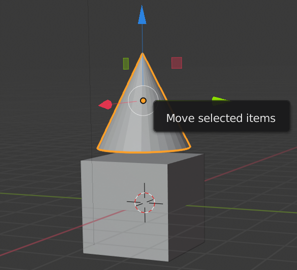
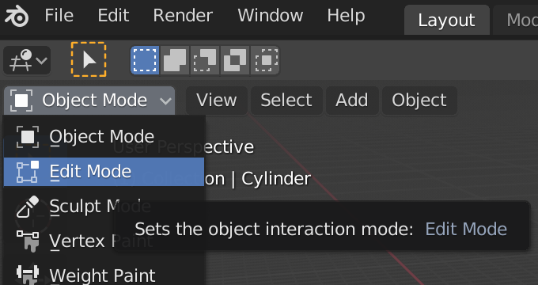
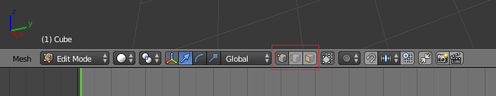
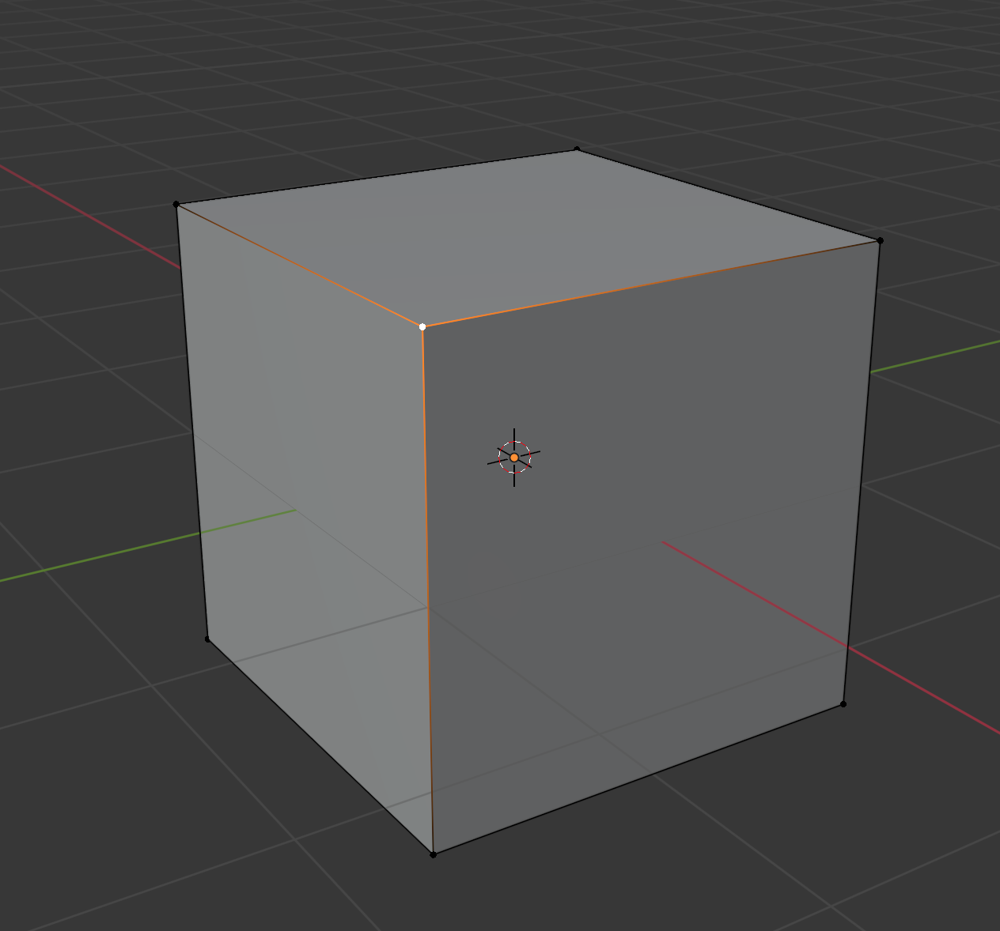
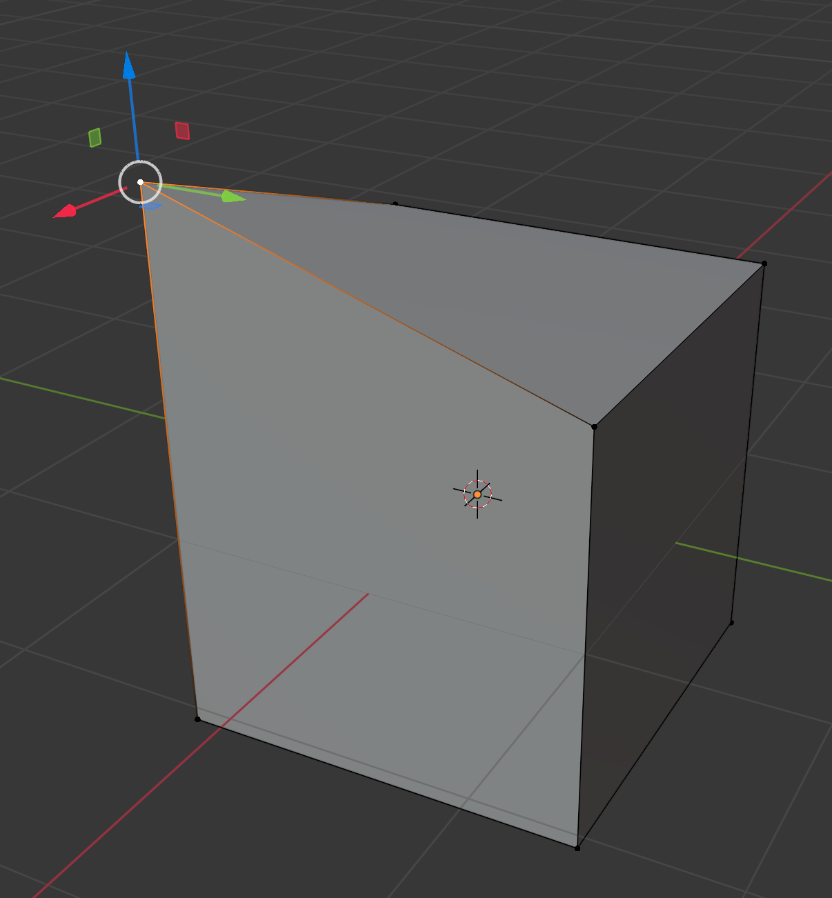
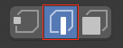
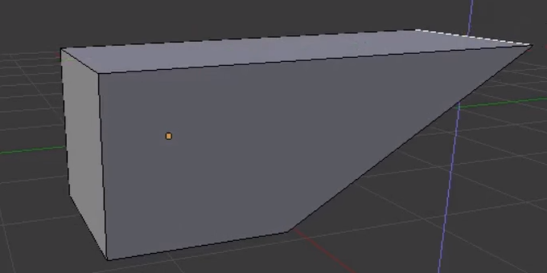
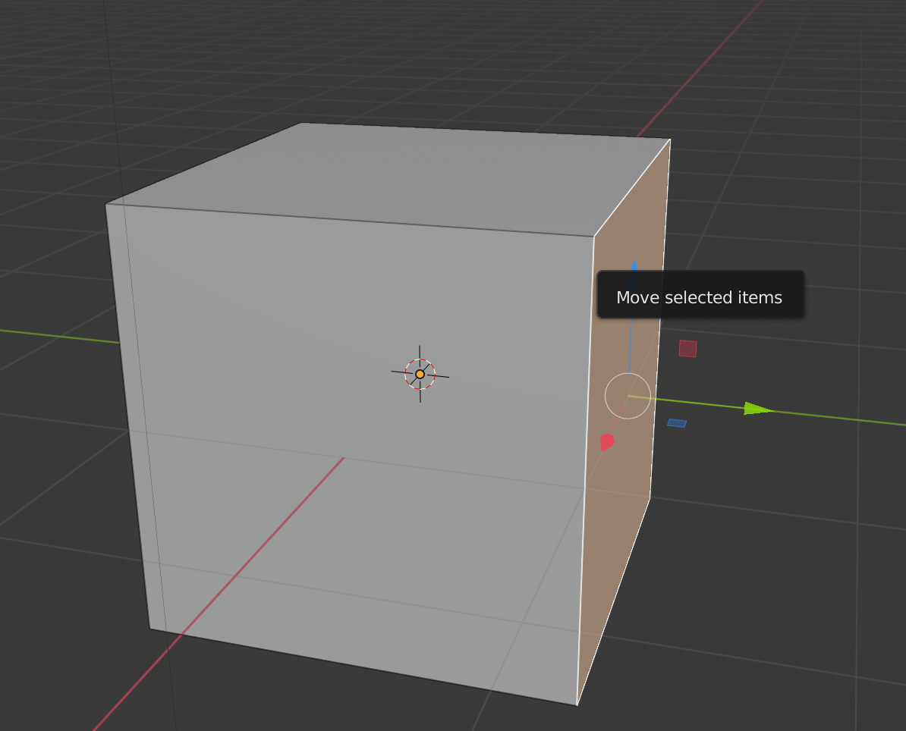

## Vertices, edges and faces

+ Open Blender and close the splash screen. You will see that a cube has been automatically added for you.

If you rotate the cube using the middle mouse button, you'll see that it doesn't look particularly house-like at the moment. You might be tempted to go to the Create tab in the Toolbox and add a cone on top of the cube. For example:

But that's not a very good solution at all. It is far easier to edit the cube itself to make it look like a house.

+ Select the cube, then go to the menu in the top left corner and select **Edit Mode**.

Now you are in a mode which allows you to edit every part of the cube to reshape it.

There are three options: you can select to edit vertices, edges, or faces from the top menu.

### Vertices

+ Choose **vertices** from the menu — this means you can select the corners of the cube.

+ Select a vertex (corner) of the cube by clicking on it.

+ Drag the vertex using the blue, green, and red handles to create a new shape. If they are not appearing, make sure the move tool is selected from the menu on the left.

If you don't like the new shape you have created, you can press <kbd>CTRL + Z</kbd> to undo the changes.

### Edges

+ Choose **edges** from the menu — this means you can select the edges of the cube.

+ Click on an edge to highlight it in white.

+ Move the edge using the blue, green, and red handles to create a new shape.

### Faces

+ Choose **faces** from the menu — this means you can select the sides of the cube.

+ Select a face by clicking on it.

+ Move the face using the blue, green, and red handles to create a new shape.

+ For now, undo the changes you have made by pressing <kbd>CTRL + Z</kbd> until you get back to the original cube.
