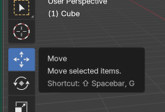
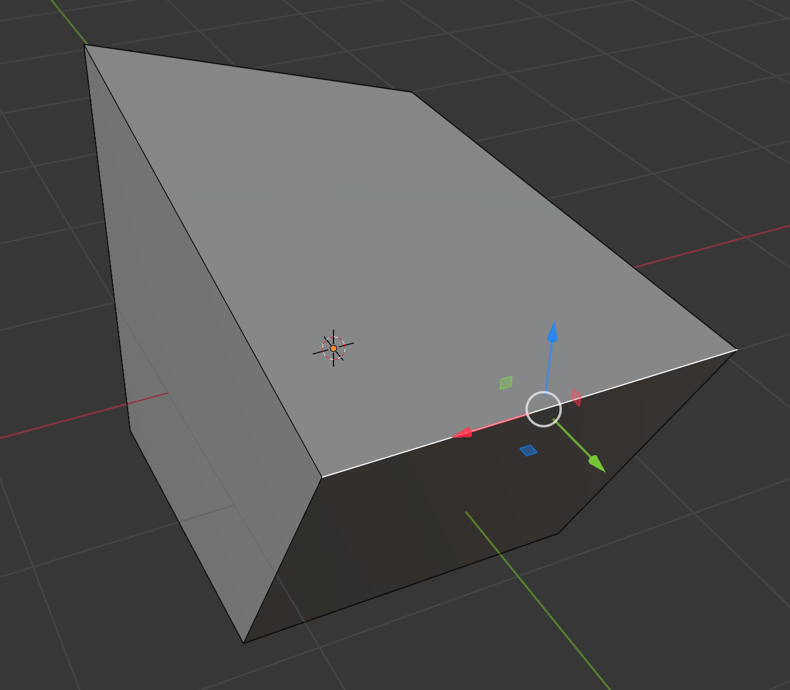
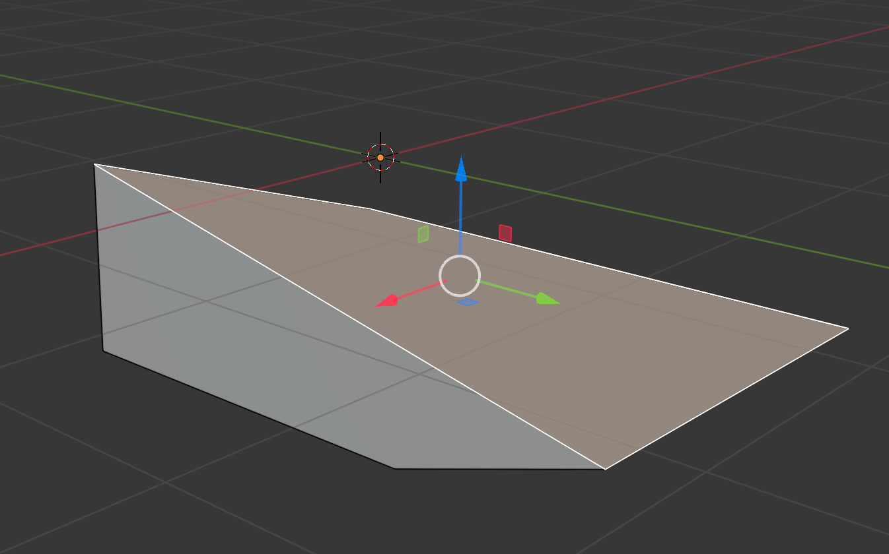

## Corners, edges and faces

--- task ---
Open Blender and exit the welcome screen by pressing <kbd>ESC</kbd>.
--- /task ---

--- task ---
Click on the cube to select it, then press <kbd>TAB</kbd> to enter **Edit Mode**.

--- /task ---

Now you are in a mode which allows you to edit every part of the cube to reshape it.

There are three options you can select: vertex (corner), edge, or face.

### Corners

--- task ---
Choose the first option - **vertex** - from the menu. Vertex is a fancy word for corner.

--- /task ---

--- task ---
Click on one of the corners of your cube.

--- /task ---

--- task ---
Select the **Move** tool.

--- /task ---

--- task ---
Drag the corner using the blue, green, and red handles to create a new shape.

--- /task ---

### Edge

--- task ---
Now choose the second menu option: **edge**.

--- /task ---

--- task ---
Select one of the edges of the cube and then move it in the same way as you did with the corner, to create a new shape.

--- /task ---

### Face

--- task ---
Finally, choose **face** from the menu — this means you can select one side of the cube.

--- /task ---

--- task ---
Practice selecting a face and then moving it to create a new shape.

--- /task ---
