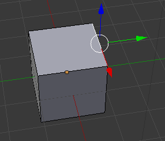
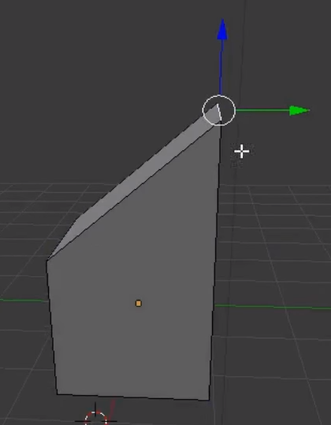

## Create half a roof

--- task ---
Click **File** > **New** > **General** in the menu at the top, to open a blank file with a cube.
--- /task ---

--- task ---
Select the **edge** tool from the top menu.

--- /task ---

+ Click to select the upper right edge of the cube.

+ Drag it upwards using the blue handle.

Now you have half a house with one edge going up to a point. You need to create the other half of the roof, but you cannot do that with a cube, because there are not enough parts to this cube to create the right shape.

In the next step you will learn how to use a tool called **extrude**, which will allow you to complete your house.
