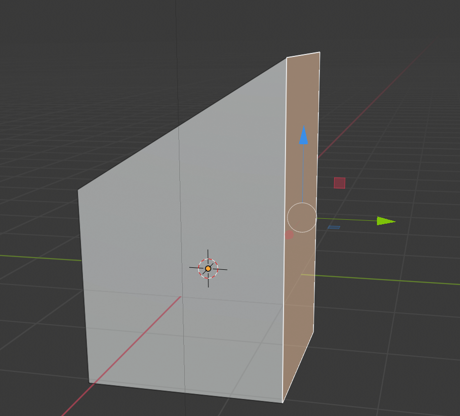

## Extrude

--- task ---
Select the **face tool** from the menu at the top.

--- /task ---

--- task ---
Click to select the right outer face of the cube.

--- /task ---

--- task ---
Select **Extrude Region** from the list of tools on the left. 

--- /task ---

--- task ---
Click and hold the mouse on the plus to start extruding the face. Drag the mouse to until you achieve the shape you are looking for, then simply let go of the mouse button.

--- /task ---