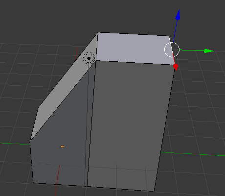
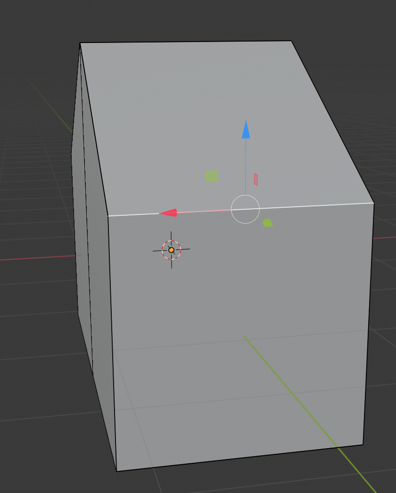

## Create the other half of the roof

+ Select **edges** from the top menu.

+ Click to select the upper right edge.

+ Select the move tool and drop the edge down to match the other side of the roof. The result will be something that looks a little bit more house-like.

Your house might look a bit unbalanced, so it's up to you to experiment and make it look better. Using the techniques you've just learnt, it is possible to start making some very complicated models.
