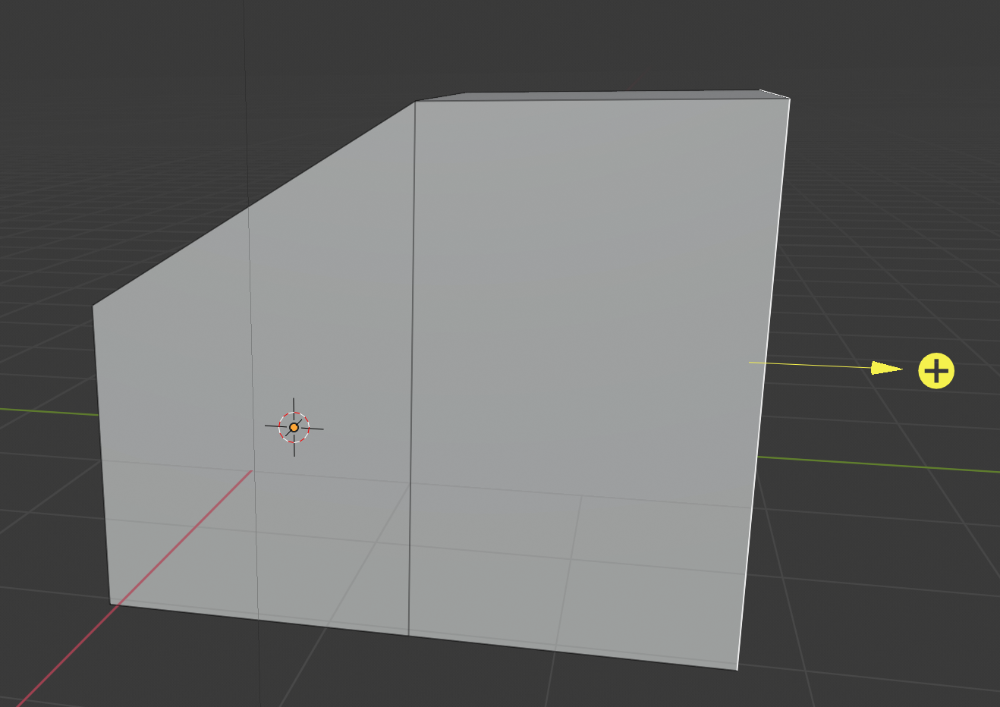

## Extrude

+ Select **faces** from the menu at the bottom.

+ Right-click to select the right outer face of the cube.

+ Go to the Toolbox bar on the left, and make sure the **Tools** tab is selected.

In the **Add** section you'll see a whole selection of **extrude** tools.

+ Select **Extrude Region**. You can now move the mouse from left to right to add another side on the house. When you are happy with what you've added, left-click to finish editing.

