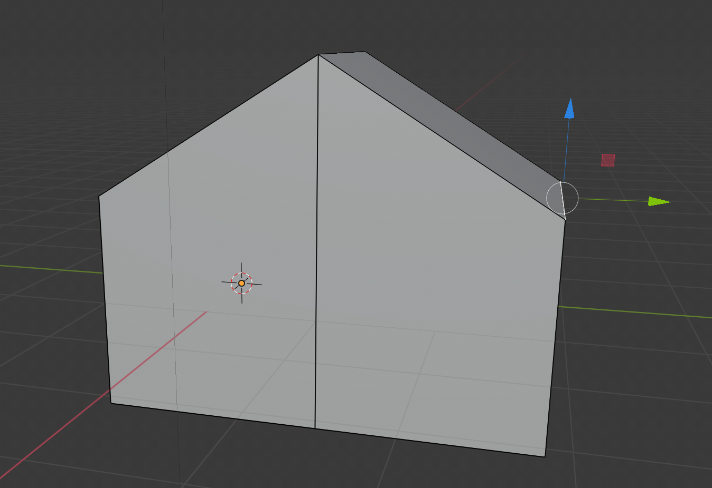

## Create the other half of the roof

+ Select edges from the lower menu.

+ Right click to select the upper right edge.

+ Drop the edge down to match the other side of the roof. The result will be something that looks a little bit more house-like.

Your house might look a bit unbalanced, but it's up to you to experiment and make it look better. Using these techniques it is possible to start making some very complicated models.
