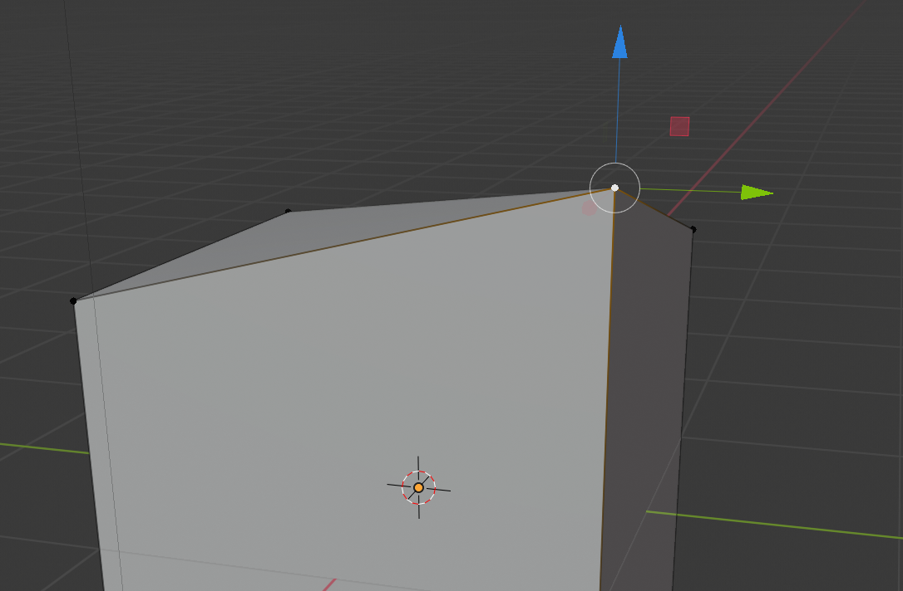

## Vértices, bordes y caras

+ Abre Blender y cierra la pantalla de bienvenida. Verás que un cubo se ha agregado automáticamente para ti.

Si giras el cubo con el botón central del ratón, verás que no se ve exactamente como una casa por el momento. Podrías tentarte en ir a la pestaña Crear en la Caja de Herramientas y agregar un cono en la parte superior del cubo. Por ejemplo:

Pero esa no es una muy buena solución en absoluto. Es mucho más fácil editar el cubo en sí para que se parezca a una casa.

+ Selecciona el cubo, luego ve al menú en la esquina superior izquierda y selecciona el** Modo de edición **.

Ahora estás en un modo que te permite editar cada parte del cubo para darle nueva forma.

Hay tres opciones que puedes seleccionar en el menú superior: editar vértices, bordes o caras.

### Vértices

+ Elige **vértices** en el menú, lo cual significa que puedes seleccionar las esquinas del cubo.

+ Selecciona un vértice (esquina) del cubo haciendo clic en él.

+ Arrastra el vértice usando las flechas azules, verdes y rojas para crear una nueva forma. Si no aparecen, asegúrate de que la herramienta de movimiento esté seleccionada en el menú de la izquierda.

Si no te gusta la nueva forma que has creado, puedes presionar <kbd>CTRL + Z</kbd> para deshacer los cambios.

### Bordes

+ Elige **bordes** en el menú, lo cual significa que puedes seleccionar los bordes del cubo.

+ Haz clic en un borde para resaltarlo en blanco.

+ Mueve el borde usando las flechas azules, verdes y rojas para crear una nueva forma.

### Caras

+ Elige **caras** en el menú — esto significa que puedes seleccionar los lados del cubo.

+ Selecciona una cara haciendo clic en ella.

+ Mueve la cara usando las flechas azules, verdes y rojas para crear una nueva forma.

+ Por ahora, deshaz los cambios que has hecho presionando <kbd>CTRL + Z</kbd> hasta que regreses al cubo original.