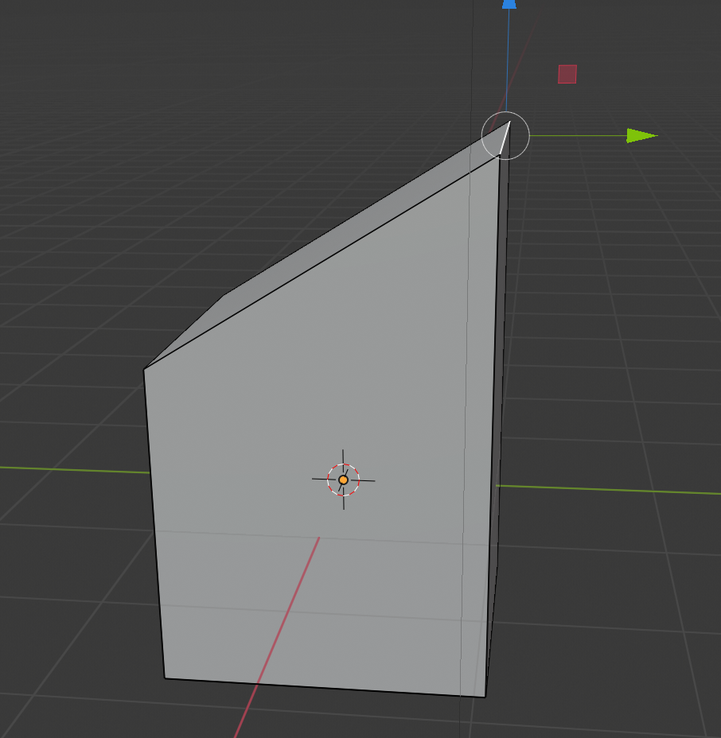

## Crea la mitad de un techo

Para crear el techo, comienza seleccionando un borde.

+ Selecciona la herramienta **borde** en el menú superior.

+ Haz clic para seleccionar el borde superior derecho del cubo.

+ Arrástralo hacia arriba usando la flecha azul.

Ahora tienes la mitad de una casa con un borde que sobresale. Necesitas crear la otra mitad del techo, pero no puedes hacerlo con un cubo porque un cubo no tiene las partes suficientes para crear la forma correcta.

En el siguiente paso aprenderás a usar una herramienta llamada **extruir**, que te permitirá completar tu casa.