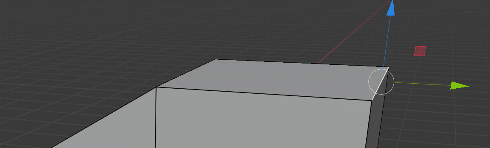

## Crea la otra mitad del techo

+ Selecciona la opción **bordes** en el menú superior.

+ Haz clic para seleccionar el borde superior derecho.

+ Selecciona la herramienta de movimiento y baja el borde para que coincida con el otro lado del techo. El resultado será algo que se parecerá un poco más a una casa.

Tu casa tal vez no luzca pareja, así que depende de tí experimentar y hacerla lucir mejor. Usando las técnicas que acabas de aprender, es posible empezar a construir modelos más complicados.