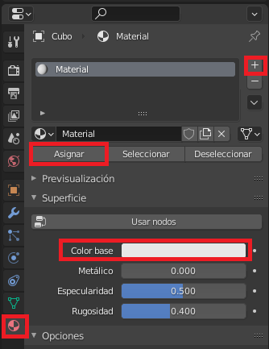
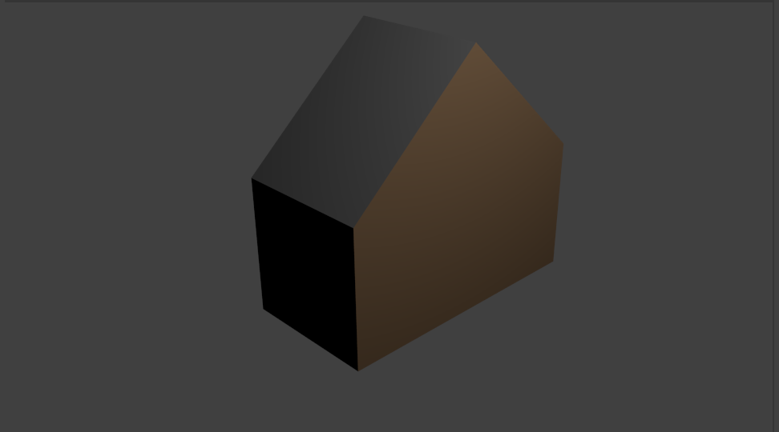

## Desafío: colorea tu casa

¿Puedes agregarle color a tu casa?

Puedes seleccionar una cara y agregarle un material para colorearla así:

+ Ve a la pestaña Propiedades de Material a la derecha y haz clic en **+**, luego crea un ** Nuevo **material.
+ Selecciona un color para tu material en **Color base**.
+ Ve al modo Edición y selecciona la cara que quieres colorear.
+ Selecciona el material, luego presiona **Asignar** para asignarle el material a la cara.

+ Prueba darle varios colores a tu casa. Por ejemplo, podrías agregarle un techo gris:

