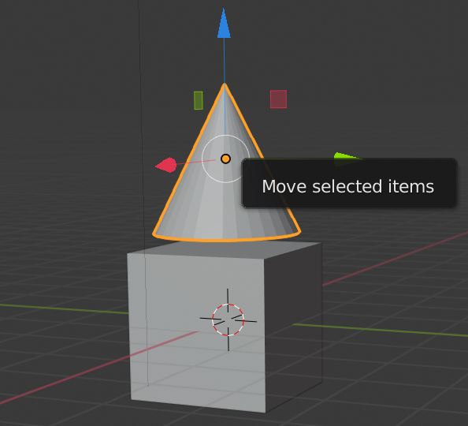
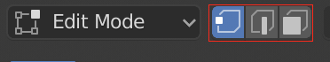
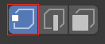
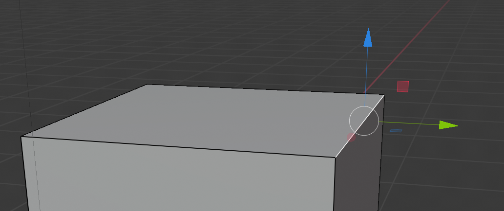

## सिरे, किनारे और चेहरे

+ Blender खोलें और Splash स्क्रीन को बंद करें। आप देखेंगे कि आपके लिए एक घन स्वचालित रूप से जोड़ा गया है।

यदि आप माउस के बीच वाले बटन का उपयोग करके घन को घुमाते हैं, तो आप देखेंगे कि फिलहाल यह विशेष रूप से घर जैसा नहीं दिख रहा है. आप टूलबॉक्स में Create टैब पर जाकर घन के शीर्ष पर कोई शंकु जोड़ने के लिए लालायित हो सकते हैं। उदाहरण के लिए:

लेकिन यह बहुत अच्छा समाधान नहीं है। घन को घर जैसा बनाने के लिए इसे ही संपादित करना कहीं अधिक आसान है।

+ घन का चयन करें, फिर ऊपरी बाएँ कोने में menu पर जाएँ और **Edit mode** चुनें।

अब आप एक ऐसे mode में हैं जो आपको घन के प्रत्येक भाग को फिर से आकार देने के लिए संपादित करने की अनुमति देती है।

आपके पास तीन विकल्प हैं: आप शीर्ष menu से कोने, किनारे या सतह को संपादित करने का चयन कर सकते हैं।

### सिरे

+ Menu से **vertices** चुनें — इसका मतलब है कि आप घन के कोनों का चयन कर सकते हैं।

+ उस पर क्लिक करके घन के एक सिरे (कोने) का चयन करें।

+ कोई नई आकृति बनाने के लिए नीले, हरे, और लाल हैंडल का उपयोग करके सिरे को खींचें। यदि वे दिखाई नहीं दे रहे हैं, तो सुनिश्चित करें कि बाईं ओर स्थित menu से move उपकरण चुना गया है।

यदि आपको अपने द्वारा बनाया गया नया आकार पसंद नहीं है, तो आप परिवर्तनों को पूर्ववत करने के लिए <kbd>CTRL + Z</kbd> दबा सकते हैं।

### किनारे

+ Menu से **edges** चुनें - इसका मतलब है कि आप घन के किनारों का चयन कर सकते हैं।

+ इसे सफेद में हाइलाइट करने के लिए एक किनारे पर क्लिक करें।

+ एक नया आकार बनाने के लिए नीले, हरे और लाल हैंडल का उपयोग करके किनारे को स्थानांतरित करें।

### सतहें

+ Menu से **faces** चुनें — इसका मतलब है कि आप घन की हर सतह का चयन कर सकते हैं।

+ उस पर क्लिक करके एक सतह का चयन करें।

+ एक नया आकार बनाने के लिए नीले, हरे और लाल हैंडल का उपयोग करके सतह को हिलाएं।

+ अभी के लिए, आप <kbd>CTRL + Z</kbd> दबाकर किए गए परिवर्तनों को पूर्ववत करें जब तक कि आप अपने वास्तविक घन को नहीं पा लेते।