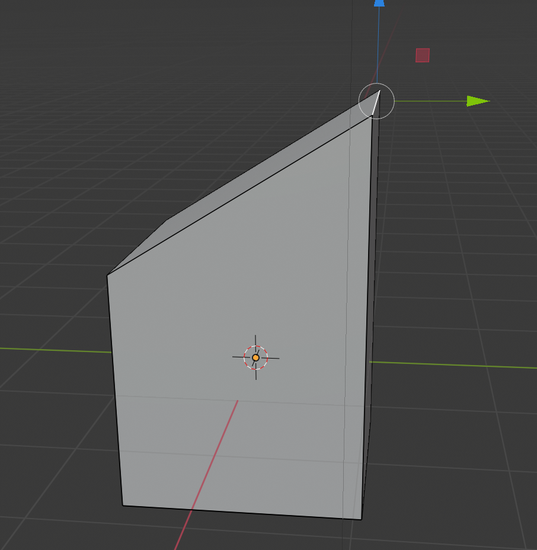

## आधी छत बनाएं

छत बनाने के लिए, एक किनारे का चयन करके शुरू करें।

+ शीर्ष menu से **edge** टूल चुनें।

+ ऊपरी दाएं किनारे का चयन करने के लिए क्लिक करें।

+ नीले हैंडल का उपयोग करके इसे ऊपर की ओर खींचें।

अब आपके पास आधा घर है जिसमें एक किनारा एक स्तर तक जा रहा है। आपको छत के दूसरे आधे हिस्से को बनाने की आवश्यकता है, लेकिन आप ऐसा घन के साथ नहीं कर सकते, क्योंकि सही आकार बनाने के लिए इस घन के पर्याप्त हिस्से नहीं हैं।

अगले चरण में आप सीखेंगे कि **extrude** नामक टूल का उपयोग कैसे करें, जो आपको अपना घर पूरा करने की अनुमति देगा।