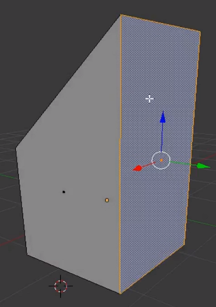
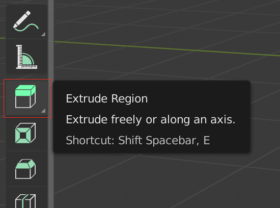

## बाहर निकालना

+ ऊपर menu से **face tool** चुनें।

+ घन के दाहिने बाहरी सतह का चयन करने के लिए क्लिक करें।

+ बाईं ओर उपकरणों की सूची से **Extrude Region** का चयन करें। 

+ सतह को बाहर निकालना शुरू करने के लिए प्लस पर माउस को क्लिक करें और दबाए रखें। माउस को तब तक खींचें जब तक आप उस आकृति को प्राप्त नहीं कर लेते, जिसकी आप तलाश कर रहे हैं, तब बस माउस बटन को छोड़ दें।

