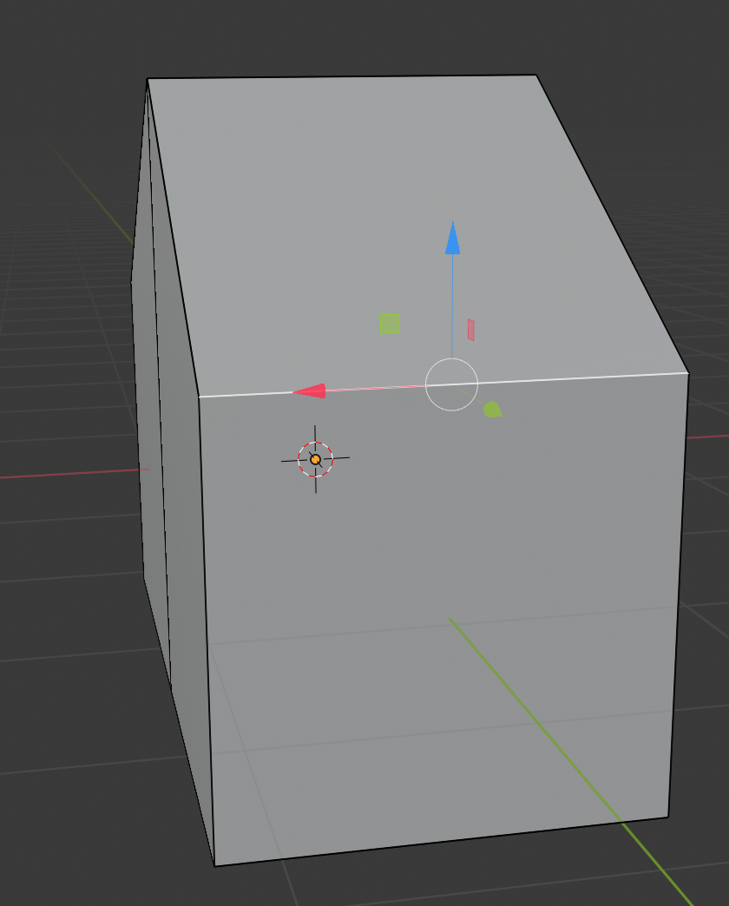

## छत का दूसरा हिस्सा बनाएं

+ ऊपर वाले menu से **edges** का चयन करें।

+ ऊपरी दाएं किनारे का चयन करने के लिए क्लिक करें।

+ चाल उपकरण का चयन करें और छत के दूसरी तरफ से मेल खाने के लिए किनारे को नीचे गिरा दें। परिणामस्वरूप जो आकृति बनेगी वह थोड़ी और अधिक घर जैसी दिखेगी।

आपका घर थोड़ा असंतुलित दिख सकता है, इसलिए यह आप पर निर्भर है कि आप परीक्षण करें और इसे ऐसा बनाएँ कि यह बेहतर दिखाई दे। आपके द्वारा अभी सीखी गई तकनीकों का उपयोग करके, कुछ बहुत ही जटिल मॉडल बनाना शुरू करना संभव है।