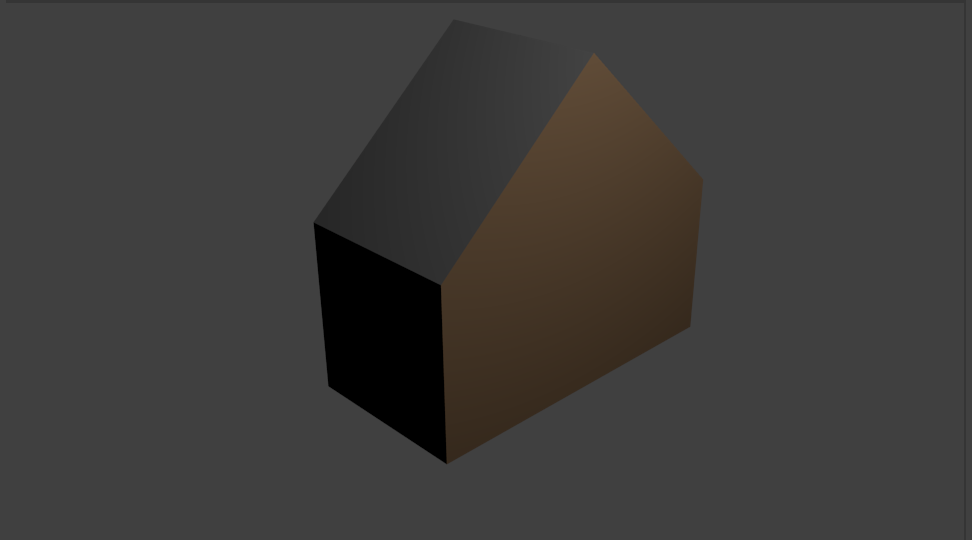

## चुनौती: अपने घर में रंग भरें

क्या आप अपने घर में रंग भर सकते हैं?

आप किसी सतह का चयन कर सकते हैं और रंग भरने के लिए इसमें कोई सामग्री जोड़ सकते हैं:

+ दाईं ओर स्थित Material properties टैब पर जाएं और **+**क्लिक करें, फिर **New** सामग्री बनाएं।
+ **Base color** तहत अपनी सामग्री के लिए एक रंग का चयन करें।
+ संपादन मोड में जाएँ और उस आकृति का चयन करें जिसे आप रंग करना चाहते हैं।
+ सामग्री का चयन करें, फिर सतह पर सामग्री निर्धारित करने के लिए **Assign** दबाएँ।

+ अपने घर को कई रंग देने का प्रयास करें। उदाहरण के लिए, आप एक धूसर रंग की छत जोड़ सकते हैं:

