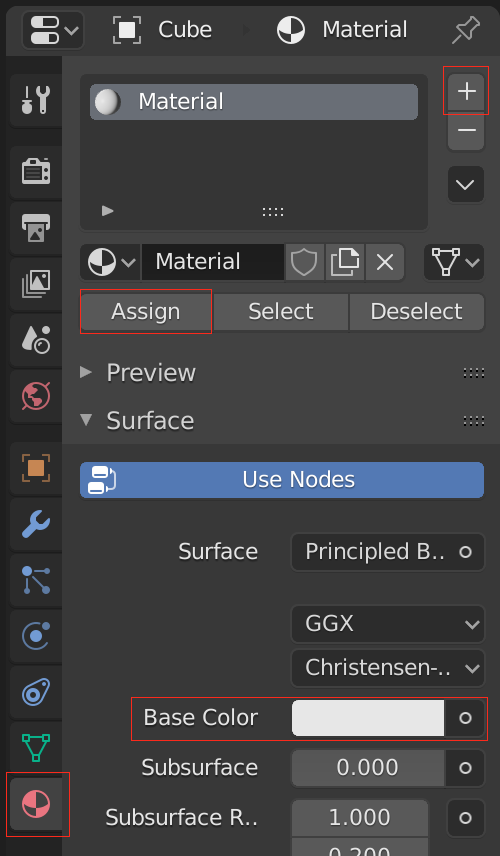

## चुनौती: अपने घर में रंग भरें

क्या आप अपने घर में रंग भर सकते हैं?

आप किसी सतह का चयन कर सकते हैं और रंग भरने के लिए इसमें कोई सामग्री जोड़ सकते हैं:

+ दाईं ओर Material (सामग्री) टैब पर जाएँ और **+** पर क्लिक करें, फिर कोई **New** सामग्री बनाएँ।

+ **Diffuse** में अपनी सामग्री के लिए किसी रंग का चयन करें।.
+ संपादन मोड में जाएँ और उस आकृति का चयन करें जिसे आप रंग करना चाहते हैं।
+ सामग्री का चयन करें, फिर आकृति पर सामग्री निर्धारित करने के लिए **Assign** दबाएँ।

+ अपने घर को कई रंग देने का प्रयास करें। उदाहरण के लिए, आप एक ग्रे रंग की छत जोड़ सकते हैं:

***
इस परियोजना का अनुवाद स्वयंसेवकों ने किया:

शगुन नरूला

बी के कार्तिक

Rahul Kumar

शुभी श्रीवास्तव

स्वयंसेवकों को धन्यवाद, हम दुनिया भर के लोगों को अपनी भाषा में सीखने का मौका दे सकते हैं। आप स्वेच्छा से अधिक लोगों तक पहुँचने में मदद कर सकते हैं - [rpf.io/translate](https://rpf.io/translate) पर अधिक जानकारी प्राप्त करें।