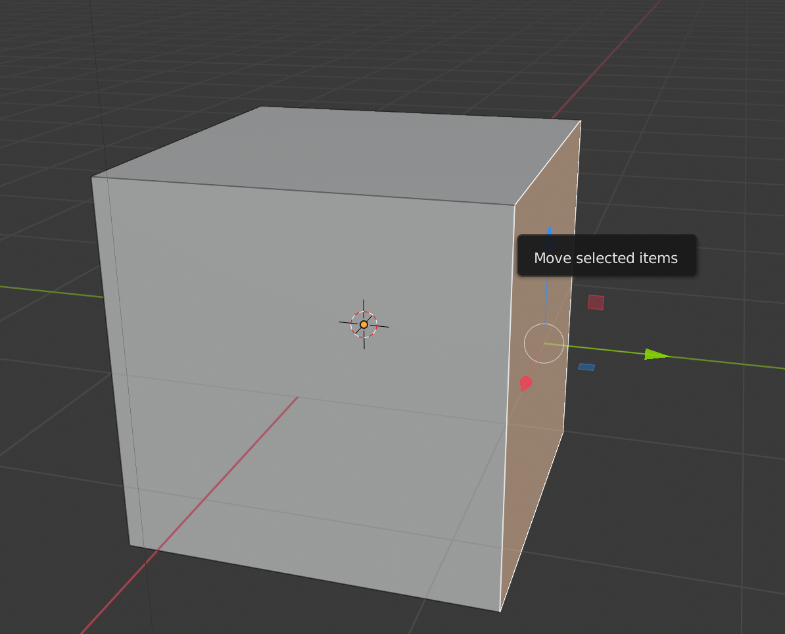

## Hoekpunten, randen en vlakken

+ Open Blender en sluit het startscherm. Je ziet dat een kubus automatisch voor je is toegevoegd.

Als je de kubus met de middelste muisknop draait, zie je dat hij er op dit moment niet bepaald huisachtig uitziet. Je zou in de verleiding kunnen komen om naar het tabblad Toevoegen in de Toolbox te gaan en een kegel bovenop de kubus toe te voegen. Bijvoorbeeld:

Maar dat is helemaal geen goede oplossing. Het is veel gemakkelijker om de kubus zelf aan te passen om het eruit te laten zien als een huis.

+ Selecteer de kubus, ga dan naar het menu in de linkerbovenhoek en selecteer **Edit Mode** (bewerkingsmodus).

Je bevindt je nu in een modus waarin je elk deel van de kubus kunt bewerken om deze opnieuw vorm te geven.

Er zijn drie opties: je kunt kiezen om hoekpunten, randen of vlakken vanuit het bovenste menu te bewerken.

### Hoekpunten

+ Kies **hoekpunten** uit het menu — dit betekent dat je de hoeken van de kubus kunt selecteren.

+ Selecteer een hoekpunt (hoek) van de kubus door erop te klikken.

+ Versleep het hoekpunt met behulp van de blauwe, groene en rode handvatten om een nieuwe vorm te maken. Als ze niet verschijnen, zorg er dan voor dat het move tool (verplaatsingsgereedschap) is geselecteerd in het menu aan de linkerkant.

Als de nieuwe vorm die je hebt gemaakt niet bevalt, kun je op <kbd>CTRL + Z</kbd> drukken om de wijzigingen ongedaan te maken.

### Randen

+ Kies **randen** uit het menu — dit betekent dat je de randen van de kubus kunt selecteren.

+ Klik op een rand om hem in wit te markeren.

+ Verplaats de rand met behulp van de blauwe, groene en rode handvatten om een nieuwe vorm te maken.

### Vlakken

+ Kies **vlakken** uit het menu — dit betekent dat je de vlakken van de kubus kunt selecteren.

+ Selecteer een vlak door erop te klikken.

+ Verplaats het vlak met behulp van de blauwe, groene en rode handvatten om een nieuwe vorm te maken.

+ Maak voorlopig de aangebrachte wijzigingen ongedaan door op <kbd>CTRL + Z</kbd> drukken totdat je terug bent bij de originele kubus.