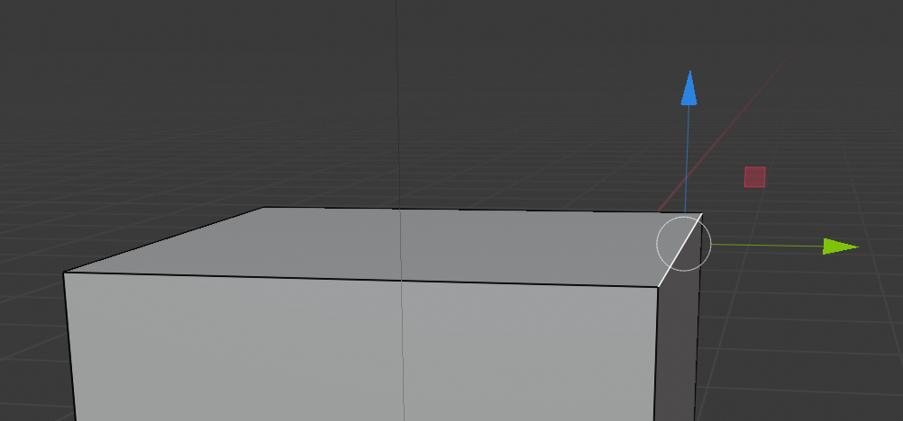

## Maak een half dak

Om een dak te maken, begin met het selecteren van een rand.

+ Selecteer de **rand** optie in het bovenste menu.

+ Klik om de rechterbovenrand van de kubus te selecteren.

+ Sleep het naar boven met het blauwe handvat.

Nu heb je een half huis waarvan de ene rand in een punt uitloopt. Je moet de andere helft van het dak maken, maar dat kun je niet doen met een kubus, omdat er niet genoeg onderdelen aan deze kubus zijn om de juiste vorm te maken.

In de volgende stap leer je hoe je een gereedschap kunt gebruiken met de naam **extrude** (uitbouwen), waarmee je je huis kunt voltooien.