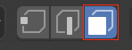
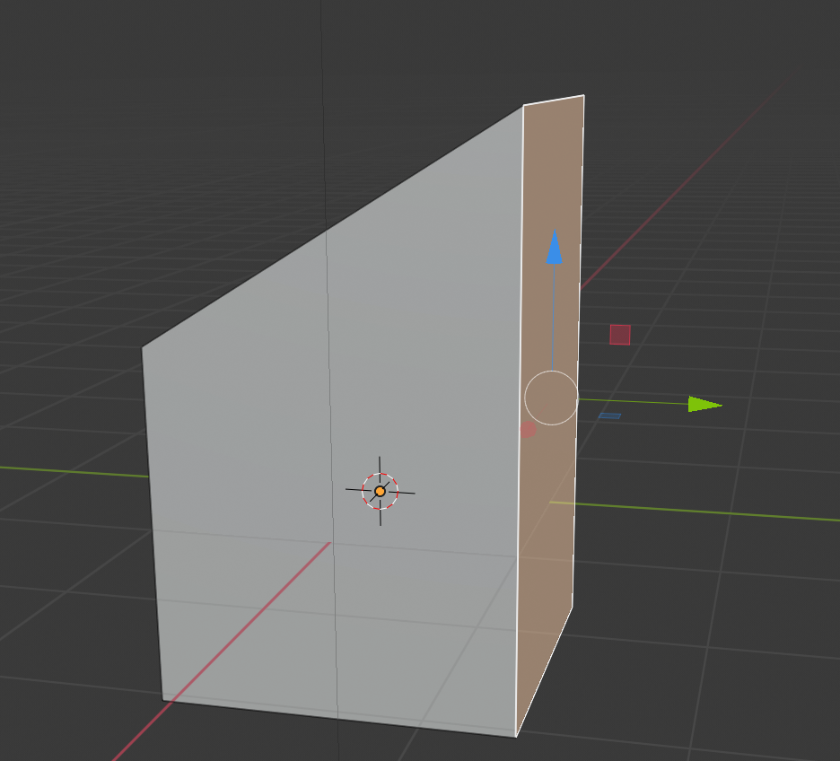
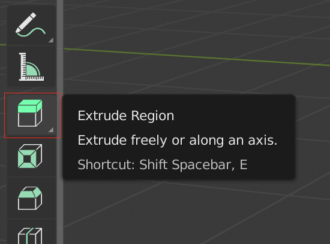
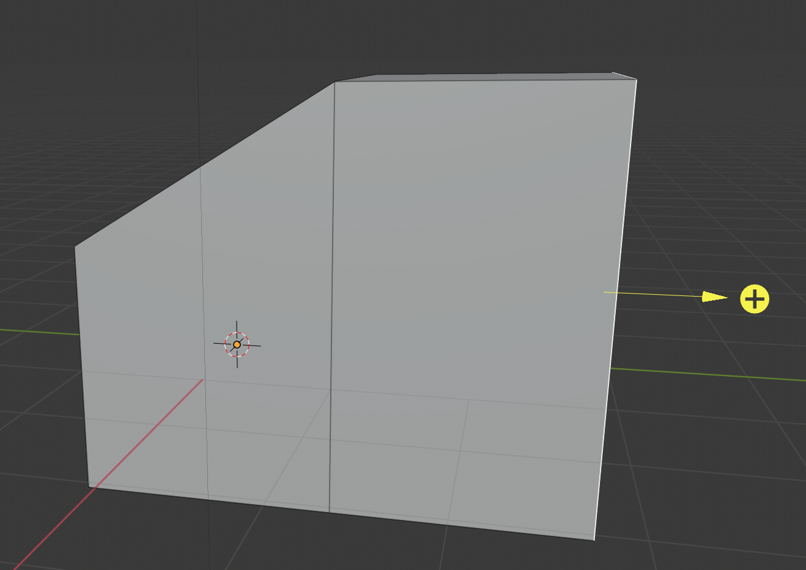

## Uitbouwen

+ Selecteer de **vlak optie** in het menu bovenaan.

+ Klik om de rechter zijkant van de kubus te selecteren.

+ Selecteer **Extrude Region** (gebied uitbouwen) uit de lijst met gereedschappen aan de linkerkant. 

+ Klik en houd de muis ingedrukt om het vlak uit te bouwen. Sleep de muis totdat je de vorm die je zoekt hebt gevonden, laat dan gewoon de muisknop los.

