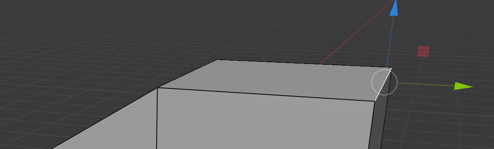
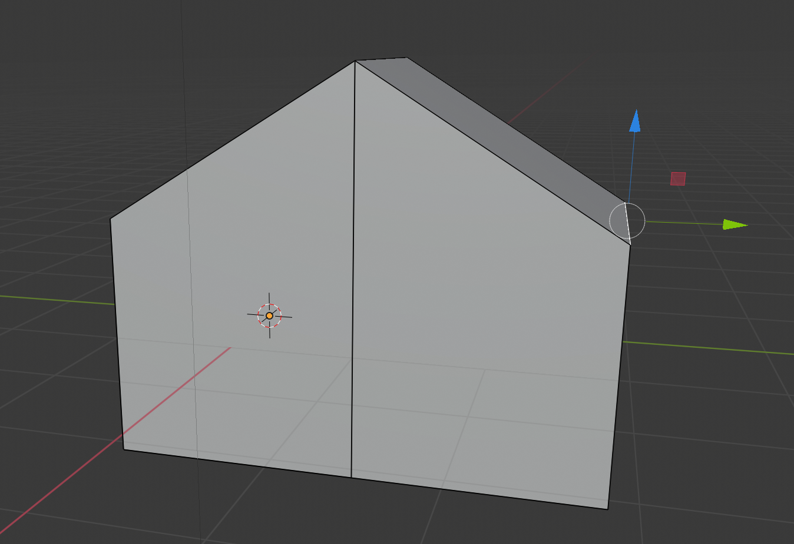

## Maak de andere helft van het dak

+ Selecteer **randen** in het bovenste menu.

+ Klik om de rechterbovenrand te selecteren.

+ Selecteer het verplaatsingsgereedschap en trek de rand naar beneden totdat deze overeenkomt met de andere kant van het dak. Het resultaat zal iets meer huisachtig lijken.

Je huis ziet er misschien een beetje onevenwichtig uit, dus het is aan jou om te experimenteren en het er beter uit te laten zien. Met behulp van de technieken die je zojuist hebt geleerd, is het mogelijk om een aantal zeer gecompliceerde modellen te maken.