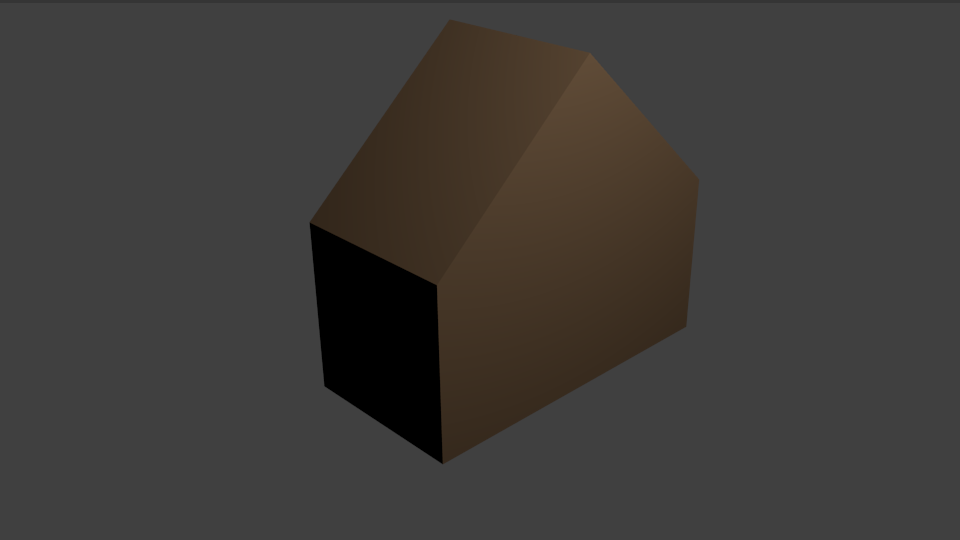
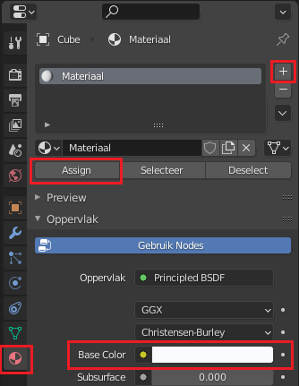
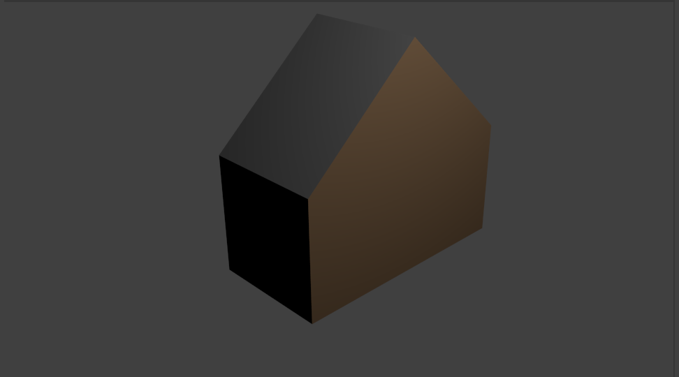

## Uitdaging: kleur je huis in

Kun je kleur aan je huis toevoegen?

Je kunt een vlak selecteren en een materiaal toevoegen aan het vlak om het in te kleuren:

+ Ga naar het tabblad Material Properties (materiaaleigenschappen) aan de rechterkant en klik op de **+**en maak vervolgens een **Nieuw** materiaal.
+ Selecteer een kleur voor je materiaal onder **Base Color** (basiskleur).
+ Ga naar de bewerkingsmodus en selecteer het vlak dat je wilt kleuren.
+ Selecteer het materiaal en druk op **Assign** (toewijzen) om het materiaal aan het vlak toe te wijzen.

+ Probeer je huis meerdere kleuren te geven. Je kunt bijvoorbeeld een grijs dak toevoegen:

